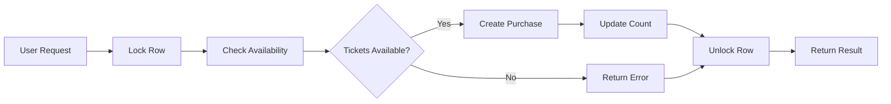

# 🚨 Execute This SQL Function in Supabase

> **CRITICAL SETUP REQUIRED** - Execute before ticket sales go live!

<div align="center">

⚠️ **Ticket purchases will NOT work until this SQL function is executed** ⚠️

</div>

---

## 📋 Quick Steps

### 1️⃣ Open Supabase SQL Editor

Go to your Supabase project dashboard:
```
https://supabase.com/dashboard/project/YOUR_PROJECT_ID
```

### 2️⃣ Navigate to SQL Editor

Click **"SQL Editor"** in the left sidebar

### 3️⃣ Create New Query

Click **"New query"** button

### 4️⃣ Copy the Migration File

Open and copy the entire contents of:
```
migrations/migration-purchase-tickets-function.sql
```

### 5️⃣ Paste and Execute

1. Paste the SQL into the editor
2. Click **"Run"** (or press `Cmd+Enter` / `Ctrl+Enter`)

### 6️⃣ Verify Success

You should see:
```
✅ Success. No rows returned
```

---

## 🔍 What This Does

This creates a PostgreSQL function called `purchase_tickets()` that **prevents race conditions** when multiple users try to buy the last tickets at the same time.

### How It Works



**Technical Details:**

| Feature | Implementation |
|---------|----------------|
| **Row Locking** | Uses `FOR UPDATE` to lock the ticket_dates row |
| **Atomic Checks** | Checks availability and capacity in one transaction |
| **Safe Insertion** | Inserts purchase only if all checks pass |
| **Error Handling** | Returns detailed JSON responses |

---

## ⚠️ Why It's Needed

### The Problem

**Without this function:**

```
Time    User A                  User B
----    ------                  ------
0ms     Check: 2 tickets left
1ms                             Check: 2 tickets left
2ms     ✅ Pass validation
3ms                             ✅ Pass validation
4ms     Buy 2 tickets
5ms                             Buy 2 tickets
RESULT: 4 tickets sold when only 2 were available! ❌
```

### The Solution

**With this function:**

```
Time    User A                  User B
----    ------                  ------
0ms     🔒 Lock + Check: 2 left
1ms                             ⏸️  Waiting for lock...
2ms     ✅ Buy 2 tickets
3ms     🔓 Unlock
4ms                             🔒 Lock + Check: 0 left
5ms                             ❌ Sold out error
RESULT: Exactly 2 tickets sold ✅
```

---

## ✅ Verification

After running the SQL, test the ticket purchase flow:

### Test 1: Normal Purchase

1. Go to `/tickets` page
2. Select a date and quantity
3. Complete the purchase form
4. Should receive confirmation email

### Test 2: Check Function Exists

Run this query in SQL Editor:
```sql
SELECT EXISTS (
  SELECT FROM pg_proc
  WHERE proname = 'purchase_tickets'
);
```

Should return `true`

### Common Errors

| Error | Cause | Solution |
|-------|-------|----------|
| `function purchase_tickets does not exist` | SQL wasn't executed | Re-run the migration file |
| `permission denied` | Wrong database role | Use service role key server-side |
| `relation ticket_dates does not exist` | Main schema not loaded | Run `supabase-schema.sql` first |

---

## 🔄 Related Files

- 📄 **Migration File**: `migrations/migration-purchase-tickets-function.sql`
- 📄 **Main Schema**: `supabase-schema.sql`
- 📁 **Migrations README**: `migrations/README.md`

---

## 📚 Additional Resources

- 📖 [PostgreSQL Locking](https://www.postgresql.org/docs/current/explicit-locking.html)
- 📖 [Supabase Functions](https://supabase.com/docs/guides/database/functions)
- 📖 [Transaction Isolation](https://www.postgresql.org/docs/current/transaction-iso.html)

---

<div align="center">

⚡ **After executing this, your ticket system is ready for production!** ⚡

</div>
