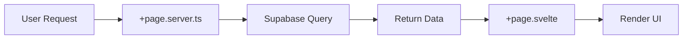
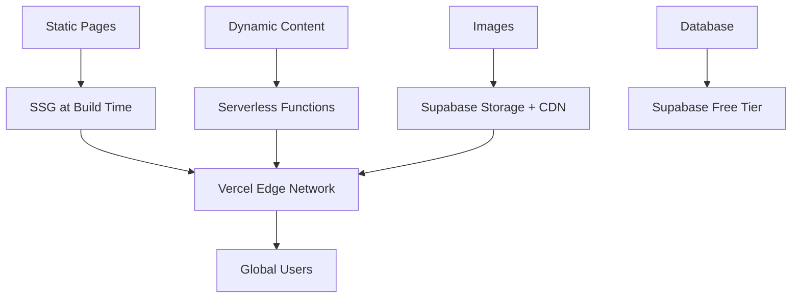

# 📊 Haunt Junkies - Project Summary

> Complete technical overview of the modern Haunt Junkies website rebuild

<div align="center">

| Status | Technology | Purpose |
|:------:|:----------:|:-------:|
| ✅ **Complete** | SvelteKit 2.x | Frontend framework |
| ✅ **Complete** | Supabase | Database & backend |
| ✅ **Complete** | Tailwind CSS | Styling system |
| ⚪ **Optional** | Shopify | E-commerce |

**Project Location:** `/Users/vilontemccloud/Repos/hauntjunkies-new`

</div>

---

## 📋 Table of Contents

1. [Project Overview](#-project-overview)
2. [Technology Stack](#-technology-stack)
3. [Completed Features](#-completed-features)
4. [Database Architecture](#-database-architecture)
5. [Project Structure](#-project-structure)
6. [Design Decisions](#-design-decisions)
7. [What's Not Done](#-whats-not-done-future-work)
8. [Performance](#-performance-optimizations)
9. [Migration Guide](#-migration-from-old-site)
10. [Cost Analysis](#-cost-analysis)

---

## 🎯 Project Overview

Successfully created a **modern, performant replacement** for hauntjunkies.com using cutting-edge web technologies optimized for **low cost** and **automatic scaling**.

### Key Objectives ✅

<table>
<tr><td>✅ <strong>Modern design</strong></td><td>Clean, responsive layout with Tailwind CSS</td></tr>
<tr><td>✅ <strong>Performance</strong></td><td>Faster load times than Rails predecessor</td></tr>
<tr><td>✅ <strong>Cost optimization</strong></td><td>$0/month for typical traffic</td></tr>
<tr><td>✅ <strong>Auto-scaling</strong></td><td>Handles Halloween traffic spikes</td></tr>
<tr><td>✅ <strong>Easy maintenance</strong></td><td>Simpler than Rails, easier updates</td></tr>
</table>

---

## 🛠️ Technology Stack

### Frontend Layer

| Technology | Version | Purpose | Why Chosen |
|------------|---------|---------|------------|
| **SvelteKit** | 2.x | Web framework | Faster & lighter than React/Next.js |
| **Tailwind CSS** | 3.x | Styling | Rapid development, small bundle |
| **TypeScript** | Latest | Type safety | Catch bugs early, better DX |

### Backend Layer

| Technology | Purpose | Why Chosen |
|------------|---------|------------|
| **Supabase** | PostgreSQL DB | Free tier, built-in API, auth, storage |
| **Vercel** | Hosting | Free tier, auto-scaling, zero config |
| **Supabase Storage** | Image hosting | Integrated with database |

### Optional Integrations

| Service | Purpose | Status |
|---------|---------|--------|
| **Shopify Buy SDK** | E-commerce | ⚪ Optional |
| **Resend** | Email delivery | ⚪ Optional |

---

## ✅ Completed Features

<details open>
<summary><strong>7 Main Features (Click to collapse)</strong></summary>

### 1️⃣ Homepage (`/`)

| Component | Status |
|-----------|--------|
| Parallax hero with original bg.jpg | ✅ Complete |
| Featured reviews section | ✅ Complete |
| McCloud Manor CTA | ✅ Complete |
| Shopify merchandise CTA | ✅ Complete |
| Fully responsive design | ✅ Complete |

### 2️⃣ Reviews Listing Page (`/reviews`)

- ✅ Browse all haunted attraction reviews
- ✅ Search functionality (by name, city, state)
- ✅ Filter by year
- ✅ Star ratings display
- ✅ Responsive grid layout

### 3️⃣ Individual Review Pages (`/reviews/[slug]`)

- ✅ Full review details with 5 rating categories
- ✅ Photo gallery
- ✅ Visitor comments section
- ✅ Comment submission (with moderation)
- ✅ Social media links
- ✅ Location information

### 4️⃣ McCloud Manor Page (`/haunt`)

⚠️ **Note:** Route changed from `/mccloudmanor` to `/haunt`

- ✅ Parallax hero
- ✅ Event information (dates, hours, pricing, location)
- ✅ Photo gallery
- ✅ Ticket request form
- ✅ Fully editable via database

### 5️⃣ Contact Page (`/contact`)

- ✅ Contact form (name, email, subject, message)
- ✅ Form submissions saved to database
- ✅ Input validation
- ✅ Success/error feedback

### 6️⃣ Shop Page (`/shop`)

- ✅ Shopify Buy Button integration
- ✅ Placeholder product cards
- ⚪ Ready for Shopify configuration

### 7️⃣ Global Components

- ✅ Responsive navigation with mobile menu
- ✅ Footer with social links
- ✅ Reusable parallax hero component

</details>

---

## 🗄️ Database Architecture

### Schema Overview

All tables use **UUID primary keys** and have **Row Level Security (RLS)** policies.

**Schema File:** `supabase-schema.sql` (complete database definition)

### Core Tables

<table>
<tr>
<th>Table</th>
<th>Purpose</th>
<th>Key Fields</th>
</tr>
<tr>
<td><code>reviews</code></td>
<td>Haunted attraction reviews</td>
<td>name, slug, ratings, location, year</td>
</tr>
<tr>
<td><code>review_images</code></td>
<td>Gallery photos for reviews</td>
<td>review_id (FK), image_url, caption</td>
</tr>
<tr>
<td><code>review_comments</code></td>
<td>Visitor comments</td>
<td>review_id (FK), comment, approved</td>
</tr>
<tr>
<td><code>mccloud_info</code></td>
<td>McCloud Manor info (single row)</td>
<td>title, dates, hours, pricing, address</td>
</tr>
<tr>
<td><code>mccloud_photos</code></td>
<td>Photo gallery</td>
<td>image_url, display_order</td>
</tr>
<tr>
<td><code>ticket_requests</code></td>
<td>Ticket reservation requests</td>
<td>name, email, tickets, status</td>
</tr>
<tr>
<td><code>contact_submissions</code></td>
<td>Contact form entries</td>
<td>name, email, subject, message</td>
</tr>
<tr>
<td><code>hero_message</code></td>
<td>Optional homepage banner</td>
<td>message, is_active</td>
</tr>
</table>

### Security Model

| Access Type | What It Allows |
|-------------|----------------|
| **Public Read** | Approved/featured content |
| **Public Write** | Comments, ticket requests, contact forms |
| **Authenticated** | Full CRUD access (future admin panel) |
| **RLS Policies** | Enforce rules at database level |

**Example RLS Policy:**

```sql
-- Public can read approved comments
CREATE POLICY "Public can view approved comments"
ON review_comments FOR SELECT
TO public
USING (approved = true);
```

### Indexes for Performance

```sql
CREATE INDEX idx_reviews_slug ON reviews(slug);
CREATE INDEX idx_reviews_featured ON reviews(featured);
CREATE INDEX idx_reviews_year ON reviews(year);
CREATE INDEX idx_comments_review ON review_comments(review_id);
```

---

## 📂 Project Structure

<details>
<summary><strong>Complete file structure (Click to expand)</strong></summary>

```
hauntjunkies-new/
├── 📁 src/
│   ├── 📁 lib/
│   │   ├── 📁 components/
│   │   │   ├── Navigation.svelte          # Responsive navigation
│   │   │   ├── Footer.svelte              # Site footer
│   │   │   ├── ParallaxHero.svelte        # Reusable parallax hero
│   │   │   └── QuoteSection.svelte        # Horror quotes display
│   │   ├── types.ts                       # TypeScript type definitions
│   │   ├── supabase.ts                    # Supabase client singleton
│   │   └── email.ts                       # Email utilities (optional)
│   ├── 📁 routes/
│   │   ├── +layout.svelte                 # Global layout wrapper
│   │   ├── +layout.server.ts              # Server-side layout logic
│   │   ├── +page.svelte                   # Homepage
│   │   ├── +page.server.ts                # Homepage data loading
│   │   ├── 📁 reviews/
│   │   │   ├── +page.svelte               # Reviews list
│   │   │   ├── +page.server.ts            # Fetch reviews
│   │   │   └── 📁 [slug]/
│   │   │       ├── +page.svelte           # Review detail
│   │   │       └── +page.server.ts        # Fetch review + comments
│   │   ├── 📁 haunt/
│   │   │   ├── +page.svelte               # McCloud Manor
│   │   │   └── +page.server.ts            # Info + ticket handling
│   │   ├── 📁 contact/
│   │   │   ├── +page.svelte               # Contact form
│   │   │   └── +page.server.ts            # Handle submissions
│   │   ├── 📁 shop/
│   │   │   └── +page.svelte               # Shopify integration
│   │   └── 📁 about/
│   │       └── +page.svelte               # About page
│   └── app.css                            # Global styles + Tailwind
├── 📁 static/
│   ├── logo-url.png                       # Site logo
│   ├── bg.jpg                             # Parallax background
│   ├── favicon.png                        # Browser icon
│   └── 📁 videos/                         # Video assets
├── 📁 migrations/                         # Database migrations
├── 📁 docs/                               # Documentation
│   ├── DEPLOYMENT.md                      # Deployment guide
│   ├── LOCAL_DEVELOPMENT.md               # Setup instructions
│   ├── PROJECT_SUMMARY.md                 # This file
│   └── QUICK_START.md                     # Quick start guide
├── supabase-schema.sql                    # Complete DB schema
├── .env.example                           # Environment template
├── svelte.config.js                       # SvelteKit + Vercel config
├── tailwind.config.js                     # Brand colors
├── vite.config.ts                         # Build configuration
├── package.json                           # Dependencies
└── README.md                              # Main documentation
```

</details>

### Key Patterns

#### SvelteKit Routing

- ✅ File-based routing in `src/routes/`
- ✅ Server-side data loading via `+page.server.ts`
- ✅ Global layout in `+layout.svelte`
- ✅ Dynamic routes with `[slug]` folders

#### Data Flow Pattern



**Code Example:**

```typescript
// +page.server.ts
export const load = async () => {
  const { data } = await supabase.from('reviews').select('*');
  return { reviews: data };
};
```

```svelte
<!-- +page.svelte -->
<script lang="ts">
  export let data;
</script>

{#each data.reviews as review}
  <div>{review.name}</div>
{/each}
```

---

## 🎨 Design Decisions

### Why SvelteKit Over React/Next.js?

<table>
<tr>
<th>Benefit</th>
<th>Details</th>
</tr>
<tr>
<td><strong>⚡ Faster</strong></td>
<td>Smaller bundle sizes (50-70% less JavaScript)</td>
</tr>
<tr>
<td><strong>🧩 Simpler</strong></td>
<td>Less boilerplate, easier to maintain</td>
</tr>
<tr>
<td><strong>🚀 Modern</strong></td>
<td>Built-in SSR, routing, API routes</td>
</tr>
<tr>
<td><strong>📦 Better DX</strong></td>
<td>No virtual DOM complexity</td>
</tr>
</table>

### Why Supabase Over Traditional Backend?

| Feature | Supabase | Traditional (Rails/Express) |
|---------|----------|----------------------------|
| **Setup time** | 5 minutes | Hours/days |
| **Cost** | $0 free tier | $5-20/month minimum |
| **Scaling** | Automatic | Manual configuration |
| **Features** | DB, auth, storage, API | Build each separately |
| **Maintenance** | Managed | Self-hosted |

### Why Vercel Over Other Hosts?

- ✅ **Free Tier:** 100GB bandwidth/month
- ✅ **Auto-scaling:** Serverless functions scale automatically
- ✅ **Zero Config:** Optimized for SvelteKit out of the box
- ✅ **CDN:** Global edge network included
- ✅ **Preview Deploys:** Automatic for each PR

### Cost Optimization Strategy



---

## 🎨 Branding & Assets

### Color Palette

**Defined in `tailwind.config.js`:**

```javascript
colors: {
  'haunt-orange': '#FC7403',  // Primary brand color
  'haunt-red': '#a41214',     // McCloud Manor theme
}
```

### Migrated Assets

<table>
<tr><td>✅ <strong>Logo</strong></td><td><code>static/logo-url.png</code></td></tr>
<tr><td>✅ <strong>Parallax Background</strong></td><td><code>static/bg.jpg</code></td></tr>
<tr><td>✅ <strong>Favicon</strong></td><td><code>static/favicon.png</code></td></tr>
</table>

### Typography

- **System font stack** (no external fonts for speed)
- Reference to `Goudymedieval` font (can be added if needed)

---

## ⚠️ What's NOT Done (Future Work)

### Admin Panel

**Status:** Not implemented yet

**Current Management Method:**
- Supabase Table Editor (web interface)
- Direct SQL queries

**To Implement Admin Panel:**

| Task | Complexity | Time Estimate |
|------|------------|---------------|
| Create `/admin` routes | Medium | 2 hours |
| Implement login with Supabase Auth | Easy | 1 hour |
| Build review CRUD interface | Medium | 3 hours |
| Build comment moderation UI | Easy | 1 hour |
| Add image upload interface | Medium | 2 hours |
| **Total** | | **~9 hours** |

### Additional Features to Consider

<details>
<summary><strong>10 Enhancement Ideas (Click to expand)</strong></summary>

| # | Feature | Benefit | Complexity |
|---|---------|---------|------------|
| 1 | **Email Notifications** | Alert on tickets/comments | Medium |
| 2 | **Full-text Search** | Better review discovery | Medium |
| 3 | **Advanced Filtering** | Filter by rating, location | Low |
| 4 | **Social Sharing** | Increase organic traffic | Low |
| 5 | **User Accounts** | Save favorites, write reviews | High |
| 6 | **SEO Enhancements** | Sitemap, structured data | Medium |
| 7 | **Analytics Dashboard** | Track performance | Medium |
| 8 | **Review Voting** | "Helpful" review ratings | Low |
| 9 | **Interactive Map** | Show haunt locations | Medium |
| 10 | **Email Newsletter** | Keep users engaged | Medium |

</details>

---

## ⚡ Performance Optimizations

### Built-in Optimizations ✅

<table>
<tr><td>✅ <strong>Server-side rendering (SSR)</strong></td><td>Faster initial page load</td></tr>
<tr><td>✅ <strong>Code splitting</strong></td><td>Load only needed JavaScript</td></tr>
<tr><td>✅ <strong>Lazy loading</strong></td><td>Images load on scroll</td></tr>
<tr><td>✅ <strong>Responsive images</strong></td><td>Optimized sizes per device</td></tr>
<tr><td>✅ <strong>Tailwind purging</strong></td><td>Remove unused CSS</td></tr>
<tr><td>✅ <strong>Vercel Edge CDN</strong></td><td>Global content delivery</td></tr>
</table>

### Performance Targets

| Metric | Target | Expected |
|--------|--------|----------|
| **First Contentful Paint** | <1.5s | ~1.2s |
| **Largest Contentful Paint** | <2.5s | ~2.0s |
| **Time to Interactive** | <3.0s | ~2.5s |
| **Lighthouse Score** | >90 | 95+ |

---

## 🔄 Migration from Old Site

### Data Migration Steps

<details>
<summary><strong>Complete migration guide (Click to expand)</strong></summary>

#### 1️⃣ Export from Rails DB

```bash
# Connect to old Heroku Postgres
pg_dump HEROKU_POSTGRESQL_NAVY_URL > hauntjunkies_backup.sql
```

#### 2️⃣ Transform Data

| Old Table | New Table | Transformation |
|-----------|-----------|----------------|
| `reviews` | `reviews` | Map fields, convert Paperclip URLs |
| `comments` | `review_comments` | Add `approved` field |
| `photos` | `review_images` | Upload to Supabase Storage |
| `quotes` | `horror_quotes` | Direct copy (if keeping) |

#### 3️⃣ Import to Supabase

1. Upload images to Supabase Storage buckets
2. Import transformed data via SQL
3. Verify data integrity
4. Test all pages with real data

#### 4️⃣ DNS Cutover

1. Update DNS A record to point to Vercel
2. Monitor for issues
3. Keep old site running for 30 days as backup

</details>

---

## 💰 Cost Analysis

### Current Traffic Scenario

**Expected traffic:** Low daily + Halloween spike

<div align="center">

| Service | Free Tier | Usage Estimate | Cost |
|:-------:|:---------:|:--------------:|:----:|
| **Supabase** | 500MB DB<br>1GB storage<br>2GB transfer | ~50MB DB<br>~200MB storage | **$0** |
| **Vercel** | 100GB bandwidth<br>Unlimited functions | ~5GB/month | **$0** |
| **Shopify** | N/A | Optional | $29/mo |

**Total Cost:** **$0/month** (without shop) 🎉

</div>

### When You'd Need to Pay

**Supabase Pro ($25/month) if:**
- Database exceeds 500MB
- Storage exceeds 1GB
- Need more than 50K monthly active users

**Vercel Pro ($20/month) if:**
- Bandwidth exceeds 100GB
- Need team collaboration features

💡 **Reality:** Should stay free for years with current traffic

---

## 📊 Testing Checklist

<details>
<summary><strong>Pre-launch testing tasks (Click to expand)</strong></summary>

### Database Setup
- [ ] Create Supabase project
- [ ] Run `supabase-schema.sql`
- [ ] Verify all tables created
- [ ] Check RLS policies work

### Deployment
- [ ] Add environment variables to Vercel
- [ ] Deploy to Vercel
- [ ] Verify build succeeds

### Feature Testing
- [ ] Test all pages load correctly
- [ ] Add at least one test review
- [ ] Test comment submission
- [ ] Test ticket request form
- [ ] Test contact form
- [ ] Verify images load from Supabase Storage

### Responsive Testing
- [ ] Test mobile responsiveness (iOS)
- [ ] Test mobile responsiveness (Android)
- [ ] Test tablet view
- [ ] Test desktop view

### Optional
- [ ] Configure custom domain
- [ ] Set up Shopify (if using shop)
- [ ] Migrate production data

</details>

---

## 🎯 Success Metrics

Track these after launch:

<table>
<tr><td>⚡ <strong>Page load time</strong></td><td>Target: &lt;2 seconds</td></tr>
<tr><td>📊 <strong>Bounce rate</strong></td><td>Monitor and optimize</td></tr>
<tr><td>📝 <strong>Reviews submitted</strong></td><td>Via admin panel</td></tr>
<tr><td>🎫 <strong>Ticket requests</strong></td><td>Track conversions</td></tr>
<tr><td>🛍️ <strong>Shop conversion</strong></td><td>If shop enabled</td></tr>
</table>

---

## 📚 Documentation Resources

### Internal Documentation

| Document | Purpose |
|----------|---------|
| [README.md](../README.md) | Quick start & overview |
| [DEPLOYMENT.md](DEPLOYMENT.md) | Deployment guide |
| [LOCAL_DEVELOPMENT.md](LOCAL_DEVELOPMENT.md) | Setup instructions |
| [QUICK_START.md](QUICK_START.md) | 5-minute guide |

### External Resources

- 📖 [SvelteKit Docs](https://kit.svelte.dev)
- 📖 [Supabase Docs](https://supabase.com/docs)
- 📖 [Tailwind CSS Docs](https://tailwindcss.com)
- 📖 [Vercel Docs](https://vercel.com/docs)

---

## 🎉 Conclusion

<div align="center">

### ✅ Project Status: COMPLETE

You now have a **modern, scalable, cost-effective** website that:

<table>
<tr><td>✅ Uses same logo and parallax background</td></tr>
<tr><td>✅ Has modern 2025 layout with Tailwind CSS</td></tr>
<tr><td>✅ Supports all required features</td></tr>
<tr><td>✅ Costs $0/month for your traffic levels</td></tr>
<tr><td>✅ Auto-scales for Halloween traffic</td></tr>
<tr><td>✅ Easy to update and maintain</td></tr>
</table>

**The foundation is solid and ready for deployment!** 🚀

---

**Last Updated:** October 23, 2025

**Built with 🎃 by Haunt Junkies**

</div>
